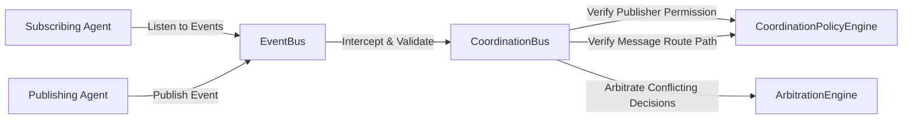

# Coordination Bus

A decentralized coordination plane that enables secure, governed, and resilient interaction protocols between autonomous agents. It ensures that multi-agent interactions adhere to architectural constraints and resolves conflicting agent behaviors.

## Architecture



### Components

1. **`event_bus.py` (EventBus)**: Implements event pub-sub propagation. Agents register callback subscriptions and publish events to structured topics.
2. **`policy_engine.py` (CoordinationPolicyEngine)**: Validates authorization rules regarding who is permitted to publish to specific topics and enforces direct communication constraints (e.g. preventing low-tier agents from initiating direct updates with deployment agents without managerial routing).
3. **`arbitration_engine.py` (ArbitrationEngine)**: Implements arbitration algorithms to resolve conflicting actions proposed by different agents on the same transaction (e.g. Support proposing a refund while Fraud proposes a block) using authority rankings and escalation overrides.
4. **`coordinator.py` (CoordinationBus)**: Acts as the central interception gateway matching incoming events against policy engines, tracking transaction decision states, and triggering the arbitration engine when conflicts arise.
5. **`trace_logger.py` (TraceLogger)**: Provides structured audit trails of agent-to-agent interactions, policy approvals, and conflict arbitration logs.
6. **`simulator.py` (Simulator)**: Sets up agents and executes simulation scenarios demonstrating authorization violations, direct path blocks, fraud-action arbitration overrides, and managerial escalations.

---

## Getting Started

### Run the Simulation
Execute the coordination simulator:
```bash
python -m coordination_bus.simulator
```
