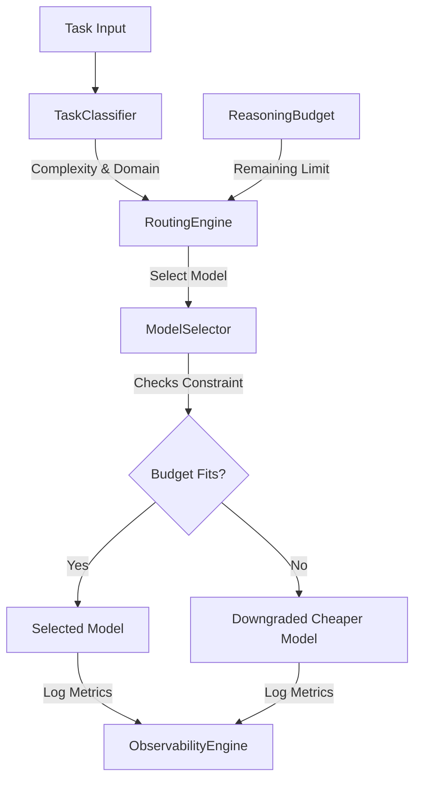

# Economic Routing & Cost-Aware Scheduling

A dynamic, cost-aware model routing and reasoning budget management system for autonomous agent clusters. Instead of running all steps on the most expensive reasoning models, it dynamically matches each task to the most cost-effective model and downgrades tasks when reasoning budgets are restricted.

## Architecture



### Components

1. **`task_classifier.py` (TaskClassifier)**: Evaluates incoming agent prompts and task instructions to determine complexity classification (LOW, MEDIUM, HIGH, CRITICAL), domain types, and token sizes.
2. **`reasoning_budget.py` (ReasoningBudget)**: Enforces financial budgets, monitors accumulated costs during task steps, and flags when the task's maximum budget limit is reached.
3. **`model_selector.py` (ModelSelector)**: Maintains pricing schemas (per 1M input/output tokens) and latency mappings for various models (e.g. `gpt-4o-mini`, `gpt-3.5-turbo`, `gpt-4o`, `claude-3-5-sonnet`, `deepseek-r1`, `o1-mini`), and handles downgrade fallbacks if estimated cost exceeds remaining budget.
4. **`routing_engine.py` (RoutingEngine)**: Orchestrates task matching, executes mock runs, calculates token consumptions, and enforces budget caps.
5. **`observability_engine.py` (ObservabilityEngine)**: Provides deep metrics logging, compares execution costs to a premium baseline (e.g., GPT-4o only), and calculates net corporate computing pool savings.
6. **`simulator.py` (Simulator)**: Simulates a batch of standard enterprise tasks and demonstrates budget-constrained model downgrades in real-time.

---

## Getting Started

### Run the Simulation
Execute the economic routing simulator:
```bash
python -m economic_routing.simulator
```
