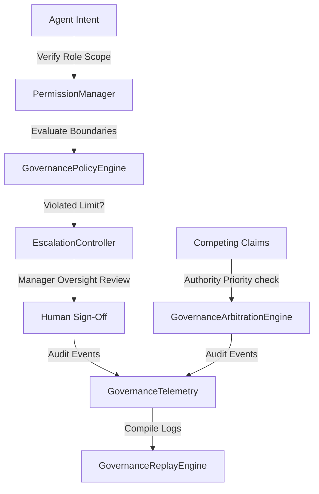

# Governance Plane & Sovereign Audits

A sovereign runtime governance and bounded autonomy management framework for autonomous agent clusters. It validates action compliance against policy boundaries, checks Role-Based Access Control (RBAC) permissions, routes exception parameters to human oversight managers (HITL), and arbitrates competing agent commands based on authority rankings.

## Governance Architecture



### Components

1. **`policy_engine.py` (GovernancePolicyEngine)**: Evaluates agent actions against corporate policy thresholds, such as automated transaction spend caps or restricted system execution parameters.
2. **`permission_manager.py` (PermissionManager)**: Implements Role-Based Access Control (RBAC) to ensure agents possess proper scope authorizations (e.g. restricting Support agents from performing data purges).
3. **`escalation_controller.py` (EscalationController)**: Dispatches exception alerts to Slack or operations channels and pauses/resumes execution threads to obtain manual human authorizations (HITL).
4. **`arbitration_engine.py` (GovernanceArbitrationEngine)**: Evaluates authority priorities to resolve conflicting commands on the same resource (e.g., Security lock overriding a Billing transaction).
5. **`governance_telemetry.py` (GovernanceTelemetry)**: Collects logs of policy results, permission validations, overrides, and escalations to support corporate compliance audits.
6. **`replay_engine.py` (GovernanceReplayEngine)**: Sequential playback of audit logs, providing clean step-by-step developer traces of the governance evaluations.
7. **`simulator.py` (Simulator)**: Executes simulations showing permission verification failures, spend limit escalations with human override, and conflict resolution arbitration.

---

## Getting Started

### Run the Simulation
Execute the governance plane simulator:
```bash
python -m governance_plane.simulator
```
