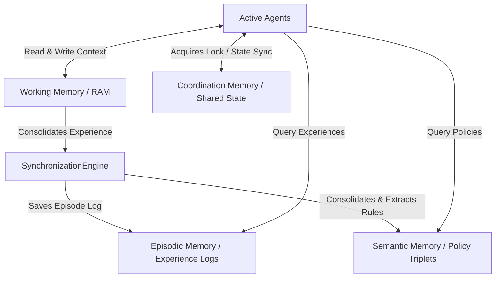

# Memory Systems Beyond RAG

A multi-layered cognitive memory architecture for autonomous agents. Instead of treating agent memory as a flat text search index (like standard Retrieval-Augmented Generation / RAG), this module models agent memory using distinct human-like cognitive levels: Working Memory, Episodic Memory, Semantic Memory, and Coordination Memory, tied together by a synchronization engine.

## Memory Architecture



### Cognitive Memory Layers

1. **`working_memory.py` (Working Memory)**: Temporary short-term cache (equivalent to registers/RAM) representing active task states, variables, and tool execution traces. Clears upon completion.
2. **`episodic_memory.py` (Episodic Memory)**: Sequential logs of past task executions, allowing agents to search and recall past success/failure experiences using keyword matching.
3. **`semantic_memory.py` (Semantic Memory)**: Long-term conceptual knowledge database represented as queryable semantic triplets `(Subject, Relation, Object)` storing business rules and agent policies.
4. **`coordination_memory.py` (Coordination Memory)**: Shared blackboard enabling multi-agent synchronization and mutual exclusion (mutex) locks to prevent race conditions during updates.
5. **`synchronization_engine.py` (SynchronizationEngine)**: Replicates cognitive memory consolidation (e.g. sleep/consolidation processes). Promotes working memory sessions to historical episodes and updates semantic models based on trace details.
6. **`simulator.py` (Simulator)**: Simulates a complete dispute resolution scenario demonstrating read/write cycles, memory query boundaries, shared pool locking, and long-term consolidation.

---

## Getting Started

### Run the Simulation
Execute the memory systems simulator:
```bash
python -m memory_systems.simulator
```
