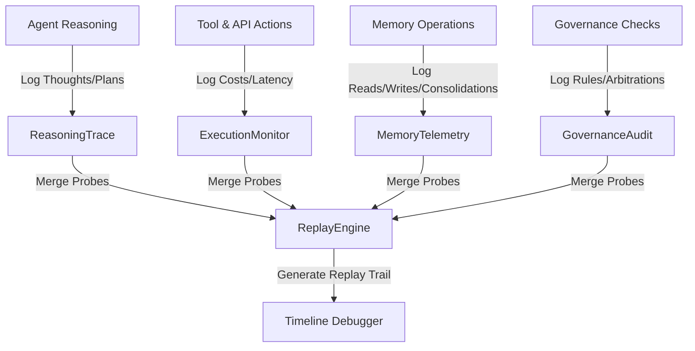

# Observability Runtime

A decision-level and performance telemetry monitoring framework for autonomous agent networks. Instead of standard application text printing, this module structures observability into four specialized logging categories (Cognitive, Performance, Memory, Governance) and compiles them into a unified chronological replay engine.

## Telemetry Architecture



### Components

1. **`reasoning_trace.py` (ReasoningTrace)**: Tracks the agent's internal thought patterns, chosen strategies, and plan updates along with the agent's confidence level at each cognitive juncture.
2. **`execution_monitor.py` (ExecutionMonitor)**: Records execution durations of tool calls, external network latency, input/output token counts, and financial costs of LLM API requests.
3. **`memory_telemetry.py` (MemoryTelemetry)**: Tracks operational interactions with memory layers, monitoring reads/writes on working/semantic structures, recall confidence on experiences, and consolidation cycles.
4. **`governance_audit.py` (GovernanceAudit)**: Audits alignment with regulatory rules, policy successes/failures, human approvals (HITL), and conflict resolution outcomes.
5. **`replay_engine.py` (ReplayEngine)**: Interleaves all log sources into a unified, chronologically ordered session event timeline, replaying the step-by-step agent lifecycle for developer troubleshooting.
6. **`simulator.py` (Simulator)**: Executes a mock corporate dispute resolution session, logs telemetry across all scopes, and plays back the consolidated timeline trace.

---

## Getting Started

### Run the Simulation
Execute the observability simulator:
```bash
python -m observability_runtime.simulator
```
