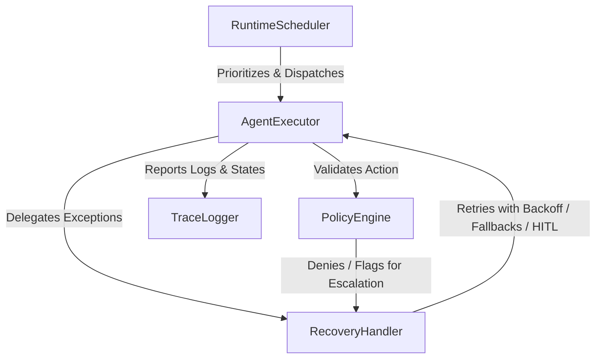

# Autonomous Enterprise Runtime Scheduler

An orchestration runtime for managing autonomous agent execution within enterprise constraints. It provides priority scheduling, policy validation boundaries (including budget constraints and role restrictions), a structured decision traceability logger, and a recovery handler that manages faults using self-healing strategies (e.g., backoff, reflection, LLM fallbacks, and human-in-the-loop validation).

## Architecture Overview



### Components

1. **`scheduler.py` (RuntimeScheduler)**: Orchestrates tasks loaded into a priority queue. Schedules execution based on priority, handles cycles, and aggregates execution metrics (durations, costs, successes).
2. **`agent_executor.py` (AgentExecutor)**: Manages step-by-step tool invocations for tasks. Integrates inline policy checks and delegates execution failures to the recovery handler.
3. **`policy_engine.py` (PolicyEngine)**: Evaluates actions before they execute. Protects systems by verifying task budgets, tool accessibility permissions for different agent roles, and transaction value limits.
4. **`recovery_handler.py` (RecoveryHandler)**: Resolves system failures using:
   - **Exponential Backoff**: For transient network errors.
   - **Model Fallbacks**: For schema validation/hallucination issues, escalating to stronger LLMs.
   - **Reflection Loops**: For modifying incorrect parameters on failed tool calls.
   - **Human-in-the-Loop (HITL)**: Escalates high-risk overrides to administrators.
5. **`trace_logger.py` (TraceLogger)**: Creates structured JSONL audit logs for every decision and prints color-coded, real-time trace events to the terminal.
6. **`simulator.py` (Simulator)**: Simulates a complete execution lifecycle demonstrating multiple tasks with various failure scenarios and recovery pathways.

---

## Getting Started

### Prerequisites
- Python 3.8+

### Running the Simulator

To run the simulator with autonomous simulated approvals:
```bash
python -m runtime_scheduler.simulator
```

To run the simulator in **interactive mode**, requiring manual terminal input for human-in-the-loop approvals:
```bash
python -m runtime_scheduler.simulator --interactive
```

### Trace Logs
All execution actions are saved to structured JSON logs inside the `traces/` folder, allowing for auditability and compliance analysis.
